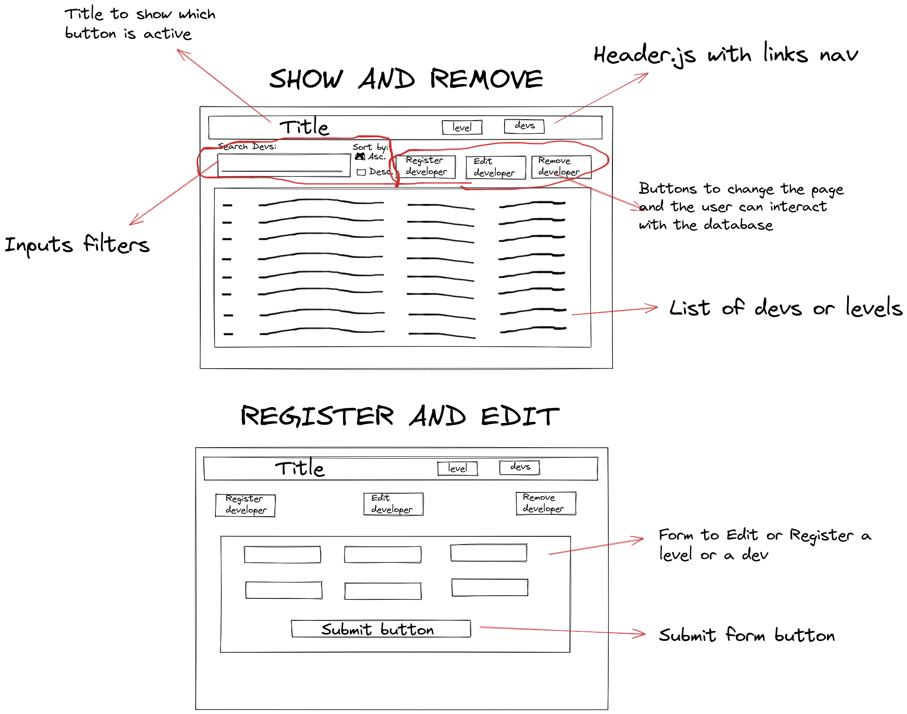

# Dev-registration-frontend

## About

> This app is a simple example of a frontend with React js. It's the intermediary of the user [with this backend.](https://dev-registration-backend.herokuapp.com/)
> [This is the link of the deployment of this frontend app.](https://dev-registration-frontend.herokuapp.com/)

---

## Getting started

- Clone this rep: `$git clone git@github.com:Murilo-Rainho/dev-registration-frontend.git`

- Enter in the directory: `$cd dev-registration-frontend`

- Install dependencies: `$npm i`

- Create an `.env` file and configure the environments variables:
> ```
> PORT=3005
> REACT_APP_BACKEND_URL=https://dev-registration-backend.herokuapp.com/
> ```

- Finally, get start with `$npm start`!

---

## Development

> This project is a fullstack application with a deadline to be developed in six days. The first day I decided to
> organize and plan how the application would be as a whole. I did an excalidraw so I could get a better feel
> during development, as well as knowing which pages and components would need to be created, and which ones
> could be reused.
> 
> 
>
> After the other 2 days working on the backend, I decided to stay only 2 days on the front, as the last one
> would be used for deploying (something I had never done before and I was able to learn and do it for the
> first time, all in the same day).
> In these two days I faced some problems with the backend link. I had forgotten some things in it and I had to
> go back to resolve these issues in a few moments. The biggest problem on the front was not the front itself, but
> the timing. Despite being easy, there were many things to do in a short time and, because of that, I ended up
> leaving (unfortunately) the TDD. As the focus was on features, I completely forgot about CSS, focusing on
> delivering something functional and visually ugly rather than something beautiful but not functional.
>
> With the exception of time, the front end was not challenging, just the problem of 'connecting' it to
> the backend (this was my first application with CRUD and fullstack).

---

## What was developed

- SPA with requests to backend and some handling visual errors to user;
- Well-componentized application with reused components;
- Redux as store;
- Routes;
- As much 'Clean Code' as possible.

---

## What was missing

- TDD;
- CSS;
- Handling more errors;
- More understanding to the user;

---
